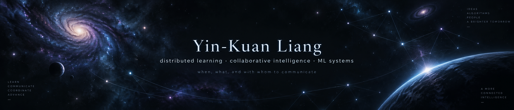
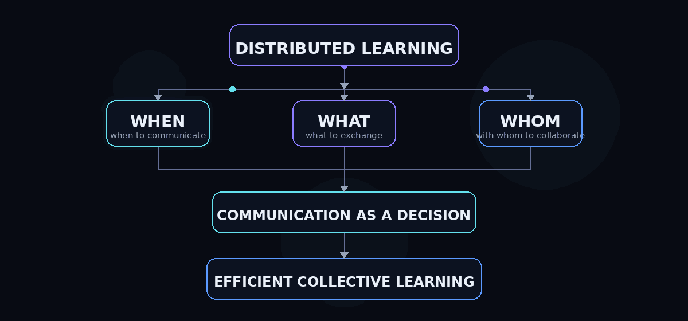

  

## Selective Communication for Distributed Learning

Learning systems should decide <b>when</b>, <b>what</b>, and <b>with whom</b> to communicate.

  

&nbsp;

&nbsp;

 

---

## Research Direction

My research studies **communication as a learnable decision** in distributed and collaborative machine learning.

Rather than assuming fixed synchronization or fixed peers, I am interested in systems that learn:

**when** communication is useful · **what** information is worth exchanging · **with whom** collaboration creates value

 

`adaptive topology` · `communication efficiency` · `causal collaboration` · `continual learning` · `distributed foundation models`

  

<b>Long-term research thread</b>

 

My current work connects four directions:

- **Adaptive collaboration** — learning sparse or dynamic communication structures instead of assuming full connectivity.
- **Communication-efficient learning** — reducing communication while preserving useful information flow and convergence.
- **Continual & causal collaboration** — estimating whether collaboration creates future value as tasks and data distributions evolve.
- **Distributed foundation models** — extending selective synchronization and adaptive communication to modern neural networks and language-model training.

---

## Selected Research

### 01 / LFHE

**Local topology adaptation for fully decentralized learning.**

`DECENTRALIZED LEARNING` · `TOPOLOGY ADAPTATION` · `NON-IID`

Local learners evolve sparse communication neighborhoods using only locally available signals under bounded communication.

 

### 02 / Dynamics & Scaling of Local Topology Evolution

**When does local topology evolution continue to scale?**

`SCALING` · `NETWORK MIXING` · `COMMUNICATION`

Studies how population size, data allocation, graph structure, and communication capacity shape decentralized learning at scale.

 

### 03 / TA-DVFG

**Sparse collaboration without representation alignment.**

`GRAPH LEARNING` · `SPARSE COLLABORATION` · `PREDICTION SPACE`

Heterogeneous graph predictors collaborate through prediction space over a learned sparse topology.

 

<b>How the projects connect</b>

 

**LFHE** studies *who should communicate* in fully decentralized learning.

**TA-DVFG** studies *which collaborators remain useful* when predictors are heterogeneous.

My current continual and causal work studies *when collaboration creates future value*.

Together, these projects move toward learning communication policies rather than treating communication as a fixed systems assumption.

<!--
Future research can be added without redesigning the page:

### 04 / Project Name

**One-line contribution.**

`TAG` · `TAG` · `TAG`

One short sentence.

-->

---

## Engineering

### I/We
Multi-agent AI collaboration platform · **3rd Place, DurHack 2025**

 

### Taiwan Stock Farm
Full-stack Taiwan equities visualization product.

 

<b>Technical stack</b>

 

`Python` · `PyTorch` · `NumPy` · `SciPy` · `NetworkX` · `Linux`  
`TypeScript` · `React` · `Next.js` · `Cloudflare Workers` · `Swift`

---

## Current Frontier

Exploring **distributed training for modern neural networks and language models** through:

`selective synchronization` · `communication-efficient training` · `adaptive collaboration`

 

  

<b>Communication should be a learned decision, not a fixed assumption.</b>

